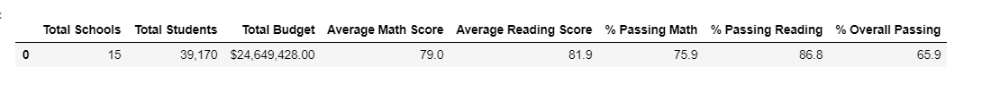
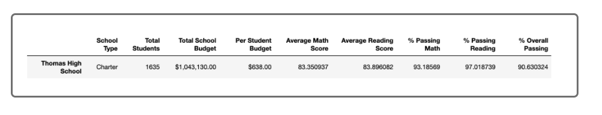

# School-District-Analysis

## Project Overview

The goal of this challenge was to replace the data that is not accurate at Thomas High School while we keep the rest of the data the same way and create the same analysis we did in the on the activities of the module. We would like to analyze our data including the total school budget, average math and average reading scores, the passing percentage for math and reading and the overall passing percentag getting very deep in the analysis for the School district.

## Results

The following image shows the overall passing percentage of the distric, in this analysis we removed math and reading scores for 9th graders at Thomas High School. Calculating the percentage from all the schools in the district of student that approved reading claa, math class and both of them.

 

The following table is from Thomas High school scores. Calculating the percentage from all the schools in the district of student that approved reading class, math class and both of them. Only considering 10th-12th grades.

 

## Summary

The changes that occurred in the analysis are the number of students, average math scores, average reading scores and the percentage of students that approved in reading and math at Thomas High school. Since the whole data set was decreased by removing the students of 9th grade and filtering only by Thomas High school. This leads to the outcomes already mentioned. 

